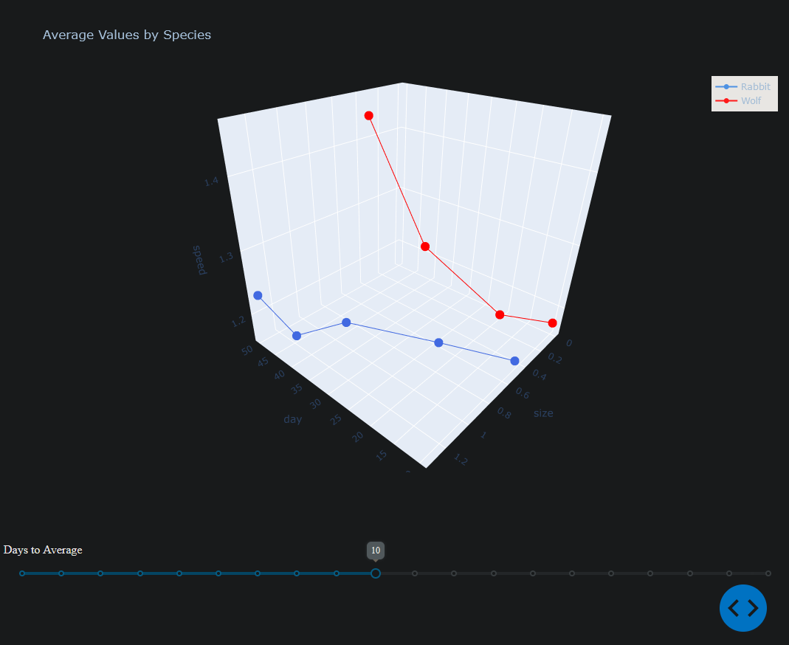
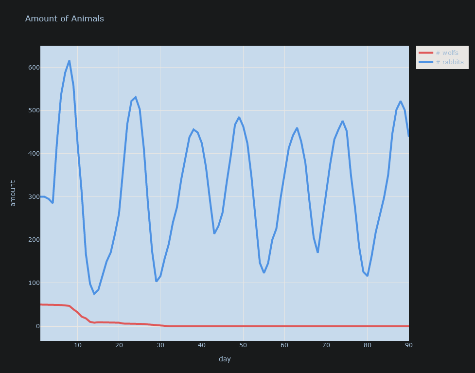
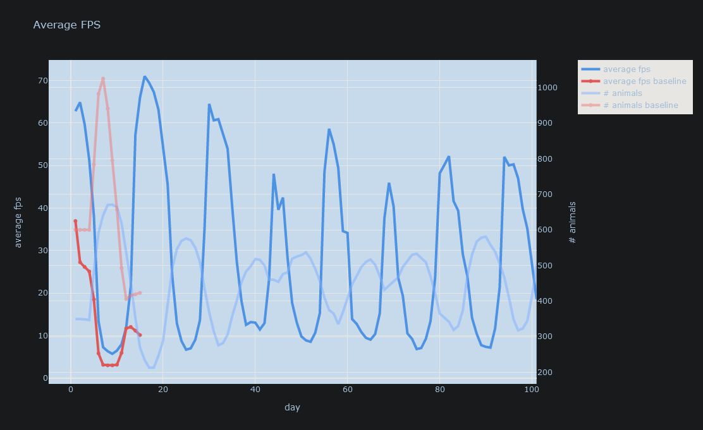

  

<h2 align="center">
  Ecosystem - A bachelor thesis project.
</h2>
This is a simulation contains rabbits and wolves in a natural environment. This readme covers the following sections:

- [Dev Tools](#dev-tools)
  - [Plot Data](#plot-data)
  - [Render State Diagrams](#render-state-diagrams)
- [Simulation Details](#simulation-details)
  - [Time relations](#time-relations)
  - [Wolves](#wolves)
  - [Rabbits](#rabbits)

# Dev Tools

Tools used for development and analysis.

## Plot Data

Install python packages with `pip install -r requirements.txt` inside the Plotting folder. Run a script in `Plotting`, it searches **recursively** for the log files from the directory the script is being ran from.

### Average Values

Run `average.py`. opens an interactive graph. Searches for `detailed.json`.

  

### Amount of Animals

Run `n_animals.py`. Searches for `detailed.json`.

  

### FPS

Run `avg_fps.py`. plots fps. Searches for `fps.csv`, `overview.csv`, `fps_baseline.csv` (the baseline fps to compare to).

  

## Render State Diagrams

`java -jar plantuml.jar states.txt` in `Meta/StateDiagrams`

# Simulation Details

This section covers information about the simulation.

## Time relations

The time in the simulation is not a perfect model of reality. We do however want the relationships between the animals fertilties/pregnancy times to be correct.
Therefore we have said that 12 hour in the game represents 1 month in real life.
1 day is therefore 2 moths

## Wolves

https://en.wikipedia.org/wiki/Wolf
Pregnancy time wolf 62-75 days
Offspring amount 5-6
Fertility time after 2 years
Generally can have 1 litter per year.

## Rabbits

https://en.wikipedia.org/wiki/Rabbit
Pregnancy time rabbit 28-35 days
Offspring average amount 5-6 but ranges from 2 to 10.
Fertility time 5-8 months
Can get pregnant the day after being pregnant...
